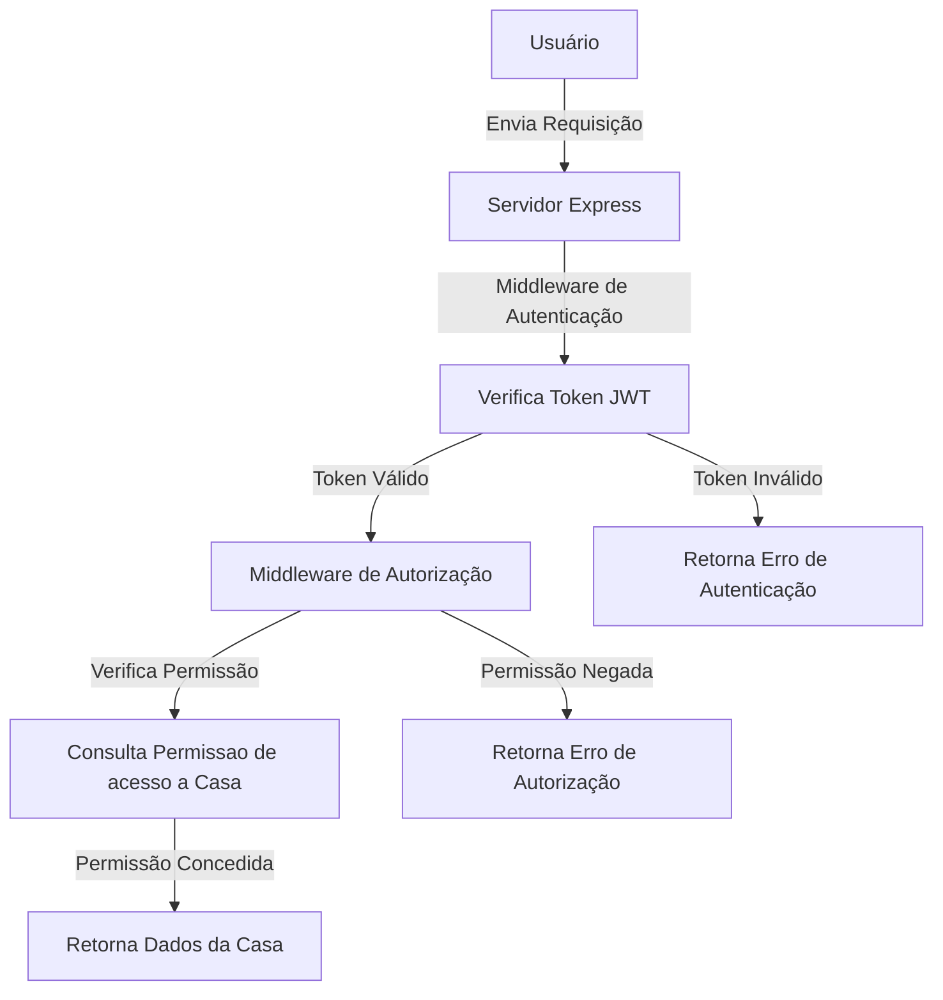
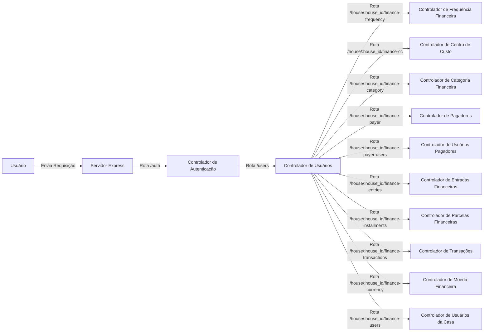

# Casa360

Casa360 é uma aplicação full-stack que combina um front-end em React com um back-end em Express. Este projeto é projetado para gerenciar transações financeiras, usuários e categorias de forma eficiente.

- Documentação da API: [API.md](API.md)

## Estrutura do Projeto

- **client/**: Contém a aplicação front-end em React.
  - **src/**: Arquivos fonte da aplicação React.
    - **components/**: Componentes reutilizáveis da aplicação.
      - **common/**: Componentes comuns reutilizáveis.
      - **layouts/**: Componentes de layout que definem a estrutura.
      - **views/**: Componentes de visualização que representam diferentes páginas.
    - **hooks/**: Hooks personalizados para gerenciamento de estado.
    - **services/**: Funções de serviço de API para comunicação com o back-end.
    - **types/**: Tipos e interfaces TypeScript.
    - **utils/**: Funções utilitárias da aplicação.
    - **App.tsx**: Componente principal da aplicação.
    - **index.tsx**: Ponto de entrada da aplicação React.
  - **package.json**: Arquivo de configuração para dependências npm.
  - **tsconfig.json**: Arquivo de configuração do TypeScript.

- **server/**: Contém a aplicação back-end em Express.
  - **src/**: Arquivos fonte da aplicação Express.
    - **controllers/**: Lógica para os endpoints da API.
    - **middleware/**: Middleware de autenticação e autorização.
    - **models/**: Modelos de dados e esquema do banco de dados.
    - **routes/**: Definições das rotas da API.
    - **services/**: Funções de interação com o banco de dados.
    - **types/**: Tipos e interfaces TypeScript.
    - **utils/**: Funções utilitárias do servidor.
    - **app.ts**: Ponto de entrada da aplicação Express.
  - **package.json**: Arquivo de configuração para dependências npm.
  - **tsconfig.json**: Arquivo de configuração do TypeScript.

- **.env**: Variáveis de ambiente para a aplicação.
- **.gitignore**: Arquivos e diretórios a serem ignorados pelo Git.
- **README.md**: Documentação do projeto.
- **API.md**: Documentação detalhada da API.

### System Design

#### Autenticação e Segurança



#### Design de Sistema de Todos os Endpoints



## Configuração e Execução

Para começar com o projeto, clone o repositório e instale as dependências para o cliente e o servidor:

```bash
# Clone o repositório
git clone <repository-url>

# Navegue até o diretório do cliente
cd client
npm install

# Navegue até o diretório do servidor
cd ../server
npm install
```

## Executando a Aplicação

Para executar a aplicação, inicie o cliente e o servidor:

```bash
# Inicie o servidor
cd server
npm start

# Inicie o cliente
cd ../client
npm start
```
